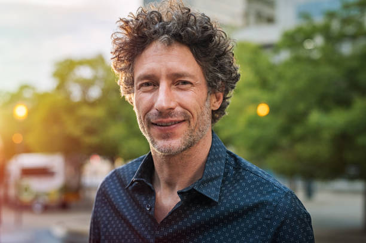
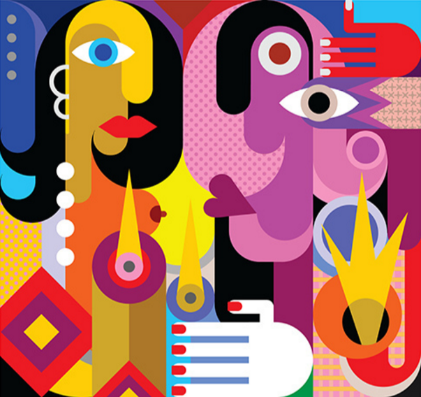
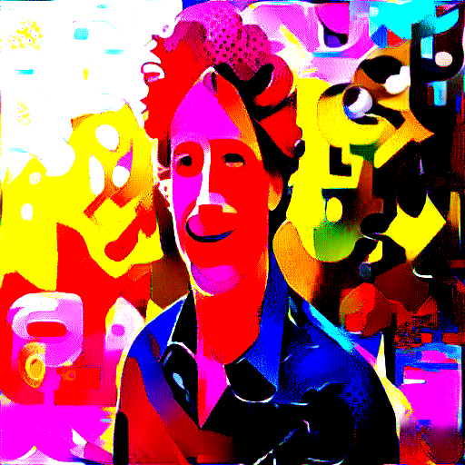
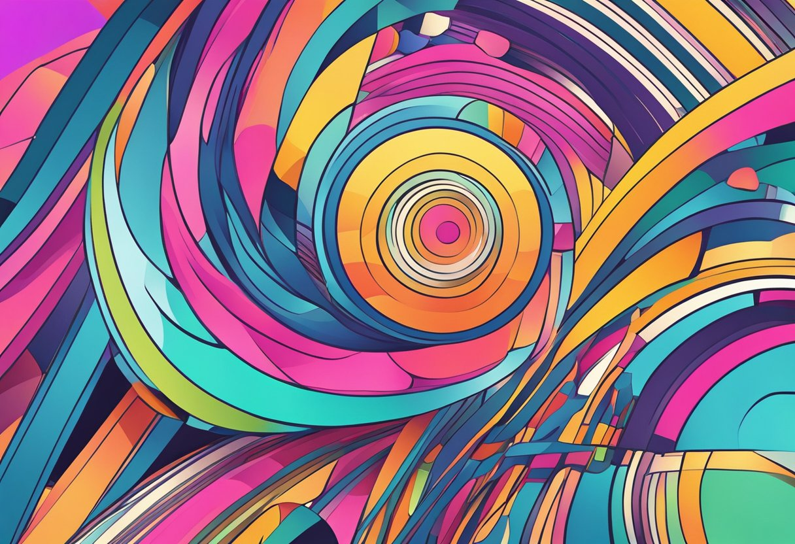
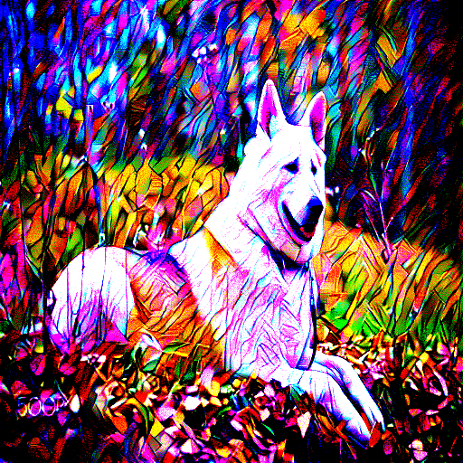
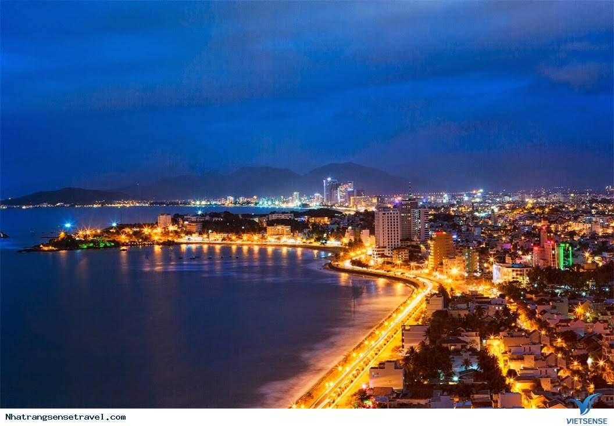
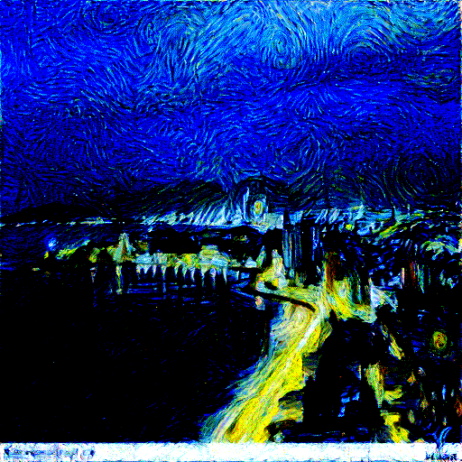

# [PYTORCH] Neural Network Image Style Transfer

https://github.com/user-attachments/assets/ae7bb7a0-73d6-4e9a-b260-35104eaed5a9

## Introduction

This project is an implementation of the [paper](https://arxiv.org/abs/1508.06576) "A Neural Algorithm of Artistic Style". The goal of this project is to build a Convolutional Neural Network (CNN) model that performs image style transfer, where the style of one image is applied to another. The output is an image that combines the content of the original image with the artistic style of the style image.
 
## How to use my code

With my code, you can:
* **Perform image style transfer with your own images**

## Requirements:

* **python 3.11**
* **pytorch**
* **torchvision**
* **PIL**
* **numpy**
* **flask**

## How It Works
The key components of this approach are:

1. **Content Image**: The image that provides the structure and object layout.
2. **Style Image**: The image that provides the artistic patterns, textures, and colors.
3. **Generated Image**: The output image which combines the content from the first image and the style from the second.

The CNN model processes both images through several layers and computes two types of losses:

1. **Content Loss**: Ensures that the generated image maintains the structure of the content image. Content loss is computed as the Mean Squared Error (MSE) between the feature representations of the content image and the generated image.
2. **Style Loss**: Ensures that the generated image captures the textures and patterns from the style image. It compares the Gram matrices of the style image and the generated image to ensure that the generated image captures the stylistic patterns of the style image.

## Implementation Details
- Framework: PyTorch is used for building and training the CNN model.
- Pre-trained Model: A pre-trained VGG19 network is used as the backbone for feature extraction. Only some layers are used as stated by the author of the paper.
- Optimization: Adam optimization is used to adjust the pixel values of the generated image to minimize both the content and style losses.

## How to Run
To run the style transfer, follow these steps:
1. Clone this repository:

        git clone https://github.com/kietran/Image-Style-Transfer.git

2. Install dependencies:

        pip install -r requirements.txt
   
3. Run the style transfer script: 

        python sv_model.py
Once the script is running, the Flask server will start, and you can access the web interface at http://127.0.0.1:8888.

Simply open your browser, navigate to the URL, and enjoy experimenting with your own images for style transfer!

## Results

Some output for experiments are shown below:

      

     

      

## Future Work
- Experiment with different layers for content and style extraction to fine-tune the results.

- Explore real-time style transfer using faster networks.
